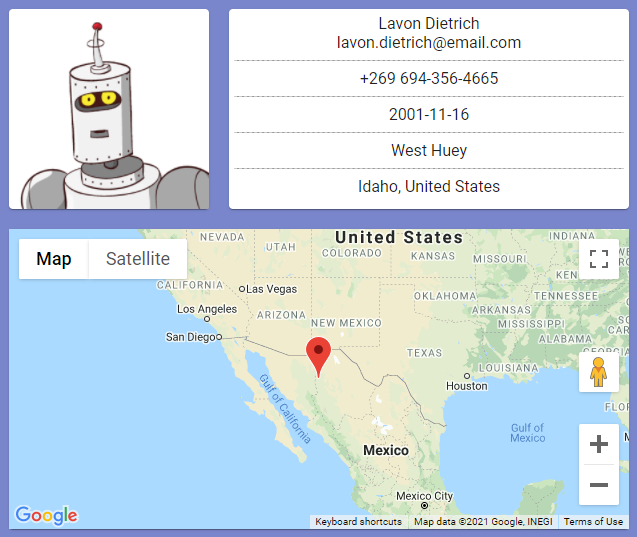

# Random User Profile

## Simple React application fetching data from [Random Data API](https://random-data-api.com/) and generating user profile

---

### Example user profile

> User address is not represented on the map below.

---

### Api Key

Put your own Google Maps Api Key in the `sample_api_key.json` file. You can generate it using [Google's Tutorial](https://developers.google.com/maps/documentation/javascript/overview).
